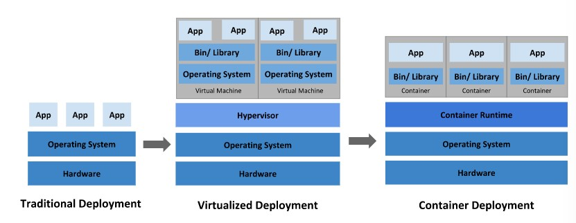

### [Kubernetes Concept 공식문서(영어)](https://kubernetes.io/docs/concepts/overview/)

---

## `Traditional -> Virtualized -> Container` Deployment
* 물리 서버를 많이 유지하기 위해서 많은 비용이 필요 
* VM으로 리소스 효율적으로 활용 & 가상화된 하드웨어 위에서 운영체제까지 실행
* 운영체제 공유 & 격리 완화


## Kubernetes 장점
### `Service discovery and load balancing`
* Kubernetes는 DNS name이나 IP 주소를 사용하여 컨테이너를 노출시킬 수 있음.
* 특정 컨테이너로의 트래픽이 너무 높으면, Kubernetes는 load balance를 하고 network traffic을 분산시켜서 해당 배포본이 안정되게 관리함.
### `Storage orchestration`
* Kubernetes는 개발자가 선택한 storage system에 자동적으로 mount하도록 도움. (local storage, public provider 등등)
### `Automated rollouts and rollbacks`
* 배포한 컨테이너의 `desired state` 를 명시화할 수 있음.  
ex) 배포시, 새 컨테이너 생성, 새로운 컨테이너를 리소스에 할당 
### `Automatic bin packing`
* Kubernetes에 컨테이너화된 작업을 실행하는 데 사용할 수 있는 노드 클러스터를 제공
* 노드는 CPU 및 RAM 양을 Kunernetes에 알려주고, Kunernetes는 리소스를 최대한 활용하기 위해 맞춘다. 
### `self-healing`
* 실패한 컨테이너를 다시 시작하고, 컨테이너를 교체하고, 사용자 정의 상태 검사에 응답하지 않는 컨테이너를 종료하고, 제공할 준비가 될 때까지 클라이언트에 알리지 않음. ~~알아서 잘해요~~
### `secret and configuration management`
* 암호, SSH 키 등의 정보를 컨테이너 이미지를 다시 빌드하지 않고 스택 구성에서 비밀을 노출하지 않고 구성을 배포하고 업데이트할 수 있음. ~~조금 더 이해 필요~~
``` text
# 원문 : 
 You can deploy and update secrets and application configuration without rebuilding your container images, and without exposing secrets in your stack configuration.
```

## Kubernetes에 대한 오해와 진실
* 오케스트레이션의 기술적 정의는 정의된 워크플로의 실행이지만, Kubernetes는 현재 상태를 원하는 상태로 지속적으로 구동하는 독립적이고 구성가능한 제어 프로세스 집합으로 구성되어있기 때문에, 단순한 오케스트레이션 시스템이 아님. -> 중앙 집중식 제어 필요 없음
* Kubernetes는 상태 비저장, 상태 저장 및 데이터 처리 워크로드를 포함하여 매우 다양한 워크로드를 지원함.
* 전통적인 PaaS 시스템이 아님.
